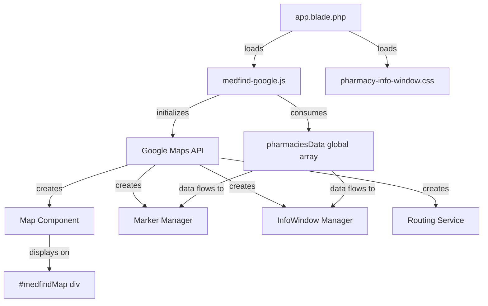

# Design Document: Leaflet to Google Maps Migration

## Overview

This design specifies the migration of the MedFind pharmacy locator from Leaflet 1.9.4 to Google Maps JavaScript API while preserving all existing functionality and visual design. The migration follows a **minimal-change strategy**: only 1 file will be edited (`app.blade.php`) and 2 new files will be created (`medfind-google.js` and `pharmacy-info-window.css`), ensuring zero disruption to the legacy Leaflet implementation until final deployment.

### Migration Philosophy

- **Incremental Deployment**: Six discrete stages with testable completion criteria
- **Preserve Legacy**: All Leaflet files remain intact during development
- **Zero Backend Changes**: Reuse existing `pharmaciesData` global array and data structures
- **Design Continuity**: Maintain MedFind branding (Navy #191970, Purple #9400D3, Lime #D9F855)
- **Script Reliability**: Bottom-of-body loading with retry logic for tunneled/proxied environments

### Key Design Decisions

1. **File Strategy**: New `medfind-google.js` instead of modifying `medfind.js` (easy rollback)
2. **Script Loading**: Bottom of `<body>` without async/defer attributes (reliability over speed)
3. **API Initialization**: Global callback with 5-attempt retry mechanism (200ms intervals)
4. **InfoWindow Rendering**: Custom HTML with external CSS for maintainability
5. **Stage-Gating**: Each stage must pass verification before proceeding to next

## Architecture

### File Changes Summary

| Action | File Path | Purpose |
|--------|-----------|---------|
| **CREATE** | `/public/js/medfind-google.js` | Google Maps implementation (replaces medfind.js functionality) |
| **CREATE** | `/public/css/pharmacy-info-window.css` | Custom InfoWindow styling |
| **EDIT** | `/resources/views/layouts/app.blade.php` | Change script reference (1 line only) |

### Component Architecture



### Data Flow

```
Backend (Laravel Controller)
  ↓
View (dashboard.blade.php)
  ↓
JavaScript Global: pharmaciesData = [{id, name, address, lat, lng, logo, medicines:[{name, price, stock}]}]
  ↓
medfind-google.js reads pharmaciesData
  ↓
Google Maps API renders markers
  ↓
User clicks marker → InfoWindow displays pharmacy details
```

## Components and Interfaces

### 1. Map Component (`GoogleMapManager`)

**Responsibilities**:
- Initialize Google Maps instance
- Handle geolocation and default centering
- Manage zoom levels (10-19)
- Handle resize/invalidation events

**Interface**:
```javascript
class GoogleMapManager {
  constructor(containerId, options)
  initialize()                    // Sets up map with retry logic
  setCenter(lat, lng)             // Updates map center
  fitBounds(bounds)               // Fits map to bounds
  getMap()                        // Returns google.maps.Map instance
}
```

**Configuration**:
- Default center: Legazpi City (13.1475, 123.7431)
- Default zoom: 13
- Map type: ROADMAP
- Controls: zoom, map type, street view
- Gesture handling: cooperative (two-finger pan on mobile)

### 2. User Location Marker (`UserLocationMarker`)

**Responsibilities**:
- Display pulsing blue dot at user's location
- Update position when geolocation changes
- Maintain higher z-index than pharmacy markers

**Interface**:
```javascript
class UserLocationMarker {
  constructor(map)
  setPosition(lat, lng)           // Updates marker position
  show()                          // Makes marker visible
  hide()                          // Hides marker
  getPosition()                   // Returns {lat, lng}
}
```

**Visual Specification**:
- Inner dot: 20px diameter, solid #4285F4 (Google Blue)
- White border: 3px solid
- Outer pulse: 40px diameter, rgba(66, 133, 244, 0.2)
- Animation: CSS pulse animation 2s infinite
- Tooltip: "You are here" on hover

### 3. Pharmacy Marker Manager (`PharmacyMarkerManager`)

**Responsibilities**:
- Create markers from pharmaciesData array
- Handle logo vs. generic icon rendering
- Filter markers based on search query
- Manage marker click events

**Interface**:
```javascript
class PharmacyMarkerManager {
  constructor(map, pharmaciesData)
  createMarkers()                 // Creates all markers
  filterMarkers(query)            // Shows/hides markers based on search
  clearMarkers()                  // Removes all markers
  getMarkersByPharmacy(id)        // Returns marker for pharmacy ID
}
```

**Marker Visual Specification**:
- Size: 48x48 pixels
- With logo: Circular frame, pharmacy logo inside, colored border (purple #9400D3)
- Without logo: Generic pharmacy icon (fa-pills), circular frame, purple background
- Border radius: 50% (perfect circle)
- Box shadow: 0 2px 6px rgba(25, 25, 112, 0.3)

**SVG Marker Template**:
```javascript
function createPharmacyMarkerIcon(pharmacy) {
  const hasLogo = pharmacy.logo && pharmacy.logo.trim() !== '';
  
  if (hasLogo) {
    return {
      url: pharmacy.logo,
      scaledSize: new google.maps.Size(48, 48),
      origin: new google.maps.Point(0, 0),
      anchor: new google.maps.Point(24, 48)
    };
  } else {
    // Create custom SVG icon for pharmacies without logos
    const svgMarker = {
      path: google.maps.SymbolPath.CIRCLE,
      fillColor: '#9400D3',
      fillOpacity: 1,
      strokeColor: '#191970',
      strokeWeight: 2,
      scale: 20
    };
    return svgMarker;
  }
}
```

### 4. InfoWindow Manager (`PharmacyInfoWindowManager`)

**Responsibilities**:
- Render custom HTML InfoWindow with pharmacy details
- Display top 3 medicines with prices
- Show action buttons (View Products, Message, Directions)
- Handle alternative pharmacy suggestions during search
- Manage InfoWindow open/close state

**Interface**:
```javascript
class PharmacyInfoWindowManager {
  constructor(map, pharmaciesData)
  open(pharmacy, marker)          // Opens InfoWindow for pharmacy
  close()                         // Closes current InfoWindow
  isOpen()                        // Returns boolean
  getCurrentPharmacy()            // Returns currently displayed pharmacy object
}
```

**InfoWindow HTML Structure**:
```html
<div class="pharmacy-info-window">
  <div class="piw-header">
     <!-- or colored initial circle -->
    <div class="piw-title-section">
      <h3 class="piw-name">Pharmacy Name</h3>
      <p class="piw-distance">2.5 km away</p>
    </div>
  </div>
  
  <div class="piw-details">
    <p class="piw-address"><i class="fas fa-map-marker-alt"></i> Address</p>
    <p class="piw-contact"><i class="fas fa-phone"></i> Contact Number</p>
    <p class="piw-hours"><i class="fas fa-clock"></i> Hours</p>
  </div>
  
  <div class="piw-medicines">
    <h4>Top Medicines</h4>
    <div class="piw-medicine-item">
      <span class="medicine-name">Medicine Name</span>
      <span class="medicine-price">₱150.00</span>
    </div>
    <!-- Repeat for top 3 -->
  </div>
  
  <div class="piw-actions">
    <button class="piw-btn piw-btn-primary" onclick="viewPharmacy(id)">
      <i class="fas fa-store"></i> View Products
    </button>
    <button class="piw-btn piw-btn-secondary" onclick="openChat(id)">
      <i class="fas fa-comments"></i> Message
    </button>
    <button class="piw-btn piw-btn-tertiary" onclick="getDirections(lat, lng)">
      <i class="fas fa-directions"></i> Directions
    </button>
  </div>
  
  <!-- Alternative pharmacies section (shown during search if current pharmacy lacks medicine) -->
  <div class="piw-alternatives" style="display:none;">
    <h4>Also available at</h4>
    <div class="piw-alt-item">
      <a href="/pharmacy/{{id}}">Pharmacy Name</a>
      <span>₱150.00 • 3.2 km</span>
    </div>
  </div>
</div>
```

**InfoWindow Sizing**:
- Fixed width: 320px
- Max height: 480px (scrollable if content exceeds)
- Border radius: 12px
- Box shadow: 0 4px 20px rgba(25, 25, 112, 0.15)

### 5. Search and Filter Service (`SearchFilterService`)

**Responsibilities**:
- Process medicine search queries
- Filter pharmaciesData by medicine availability
- Update marker visibility
- Update stats badges (pharmacy count, medicine count)
- Trigger nearest pharmacy suggestion panel

**Interface**:
```javascript
class SearchFilterService {
  constructor(pharmaciesData, markerManager)
  performSearch(query)            // Filters and updates markers
  clearSearch()                   // Resets to show all pharmacies
  getCurrentQuery()               // Returns active search string
  getFilteredPharmacies()         // Returns filtered pharmacy array
}
```

**Search Logic**:
1. Convert query to lowercase
2. Filter pharmaciesData: `medicine.name.toLowerCase().includes(query) && medicine.stock > 0`
3. Update markerManager to show only matching markers
4. Update badge: "X pharmacies with [Medicine Name]"
5. If results found, show nearest suggestion panel with top 3

### 6. Routing Service (`DirectionsService`)

**Responsibilities**:
- Calculate routes from user location to pharmacy
- Display route polyline on map
- Show route summary (distance, time)
- Provide turn-by-turn directions
- Handle alternative routes

**Interface**:
```javascript
class DirectionsService {
  constructor(map, userLocation)
  calculateRoute(destination)     // Calculates route to {lat, lng}
  displayRoute(result)            // Renders route on map
  clearRoute()                    // Removes route display
  toggleSteps()                   // Shows/hides turn-by-turn panel
  getActiveRoute()                // Returns current route object
}
```

**Google Maps APIs Used**:
- `google.maps.DirectionsService` for route calculation
- `google.maps.DirectionsRenderer` for visualization
- Route options: `travelMode: DRIVING`, `provideRouteAlternatives: true`

**Route Display Specification**:
- Primary route: Solid purple line (#9400D3), 5px width
- Alternative routes: Dashed gray line (#999), 3px width, 50% opacity
- Origin marker: Blue pulsing dot (user location)
- Destination marker: Purple pharmacy marker
- Route info bar: Fixed bottom position, white background, shadow

### 7. Nearest Pharmacy Suggestion Panel (`SuggestionPanelManager`)

**Responsibilities**:
- Display top 3 nearest pharmacies after search
- Show pharmacy name, distance, price, stock
- Provide "Go" (directions) and "View" (details) buttons
- Handle panel visibility and dismissal

**Interface**:
```javascript
class SuggestionPanelManager {
  constructor(map, pharmaciesData)
  show(filteredPharmacies, query) // Shows panel with top 3 results
  hide()                          // Hides panel
  isVisible()                     // Returns boolean
}
```

**Panel HTML Structure**:
```html
<div class="nearest-suggestion-panel">
  <div class="nsp-header">
    <h3>Nearest with [Medicine Name]</h3>
    <button class="nsp-close" onclick="hideSuggestionPanel()">×</button>
  </div>
  <div class="nsp-items">
    <div class="nsp-item">
      <div class="nsp-info">
        <h4>Pharmacy Name</h4>
        <p>₱150.00 • 2.5 km • 10 in stock</p>
      </div>
      <div class="nsp-actions">
        <button class="nsp-btn-go" onclick="getDirections(lat, lng)">Go</button>
        <button class="nsp-btn-view" onclick="viewPharmacy(id)">View</button>
      </div>
    </div>
    <!-- Repeat for top 3 -->
  </div>
</div>
```

### 8. Location Editor (`PharmacyLocationEditor`)

**Responsibilities**:
- Display editable map for pharmacy location setting
- Handle draggable marker
- Perform geocoding and reverse geocoding
- Update form fields with coordinates
- Provide address autocomplete

**Interface**:
```javascript
class PharmacyLocationEditor {
  constructor(containerId, initialLat, initialLng)
  initialize()                    // Sets up editor map
  setMarkerPosition(lat, lng)     // Updates marker location
  onMarkerDrag(callback)          // Registers drag event handler
  getCurrentLocation()            // Returns {lat, lng}
  geocodeAddress(address)         // Converts address to coords
  reverseGeocode(lat, lng)        // Converts coords to address
}
```

**Autocomplete Configuration**:
- Use `google.maps.places.Autocomplete`
- Restrict to Philippines: `componentRestrictions: { country: 'ph' }`
- Fields: `geometry.location, formatted_address`

## Data Models

### Pharmacy Data Structure (from pharmaciesData)

```javascript
{
  id: number,                     // Pharmacy ID
  name: string,                   // Pharmacy name
  address: string,                // Full address
  lat: number,                    // Latitude (6 decimal places)
  lng: number,                    // Longitude (6 decimal places)
  logo: string | null,            // Logo URL or null
  contactNumber: string | null,   // Phone number
  hours: string | null,           // Operating hours
  distance: number,               // Calculated distance from user (km)
  medicines: [
    {
      name: string,               // Medicine name
      price: number,              // Price in PHP
      stock: number               // Stock quantity
    }
  ]
}
```

### Google Maps Configuration Object

```javascript
const mapOptions = {
  center: { lat: 13.1475, lng: 123.7431 },
  zoom: 13,
  minZoom: 10,
  maxZoom: 19,
  mapTypeId: google.maps.MapTypeId.ROADMAP,
  gestureHandling: 'cooperative',
  zoomControl: true,
  mapTypeControl: true,
  streetViewControl: true,
  fullscreenControl: false,
  styles: [] // Custom styles optional for branding
};
```

## Error Handling

### Google Maps API Loading Errors

**Error Type**: API script fails to load (network issues, proxy blocking, invalid key)

**Handling Strategy**:
```javascript
function initializeWithRetry(attemptCount = 0) {
  const maxAttempts = 5;
  
  if (typeof google === 'undefined' || !google.maps) {
    if (attemptCount < maxAttempts) {
      console.warn(`Google Maps API not ready, retrying... (${attemptCount + 1}/${maxAttempts})`);
      setTimeout(() => initializeWithRetry(attemptCount + 1), 200);
    } else {
      displayErrorMessage('Map failed to load. Please refresh the page.');
      console.error('Google Maps API failed to load after 5 attempts');
    }
    return;
  }
  
  // Proceed with initialization
  initializeMap();
}
```

**User-Facing Error Message**:
- Display modal/banner: "Map could not load. Please check your connection and refresh the page."
- Log technical details to console for developer debugging
- Do NOT expose API keys in error messages

### Geolocation Errors

**Error Type**: User denies geolocation permission or geolocation unavailable

**Handling Strategy**:
```javascript
if (navigator.geolocation) {
  navigator.geolocation.getCurrentPosition(
    (position) => {
      // Success: use position.coords.latitude, position.coords.longitude
      userLat = position.coords.latitude;
      userLng = position.coords.longitude;
      map.setCenter({ lat: userLat, lng: userLng });
      updateUserLocationMarker(userLat, userLng);
    },
    (error) => {
      // Error: fall back to default location
      console.warn('Geolocation error:', error.message);
      userLat = 13.1475;  // Legazpi City
      userLng = 123.7431;
      map.setCenter({ lat: userLat, lng: userLng });
      // Do NOT show user location marker if permission denied
    }
  );
} else {
  // Geolocation not supported: use default location
  userLat = 13.1475;
  userLng = 123.7431;
  map.setCenter({ lat: userLat, lng: userLng });
}
```

### Geocoding Errors

**Error Type**: Address cannot be geocoded or reverse geocoding fails

**Handling Strategy**:
```javascript
geocoder.geocode({ address: addressString }, (results, status) => {
  if (status === google.maps.GeocoderStatus.OK) {
    const location = results[0].geometry.location;
    setMarkerPosition(location.lat(), location.lng());
  } else if (status === google.maps.GeocoderStatus.ZERO_RESULTS) {
    alert('Address not found. Please try a different search.');
  } else {
    console.error('Geocoding error:', status);
    alert('Could not find location. Please try again.');
  }
});
```

### Routing Errors

**Error Type**: Directions service fails (no route available, network error)

**Handling Strategy**:
```javascript
directionsService.route(request, (result, status) => {
  if (status === google.maps.DirectionsStatus.OK) {
    directionsRenderer.setDirections(result);
    displayRouteInfo(result);
  } else if (status === google.maps.DirectionsStatus.ZERO_RESULTS) {
    alert('No route found to this pharmacy.');
  } else {
    console.error('Directions error:', status);
    alert('Could not calculate route. Please try again.');
  }
});
```

### Empty Search Results

**Error Type**: Search query returns no matching pharmacies

**Handling Strategy**:
- Update badge: "No results for [Query]"
- Display temporary popup: "No pharmacies have [Medicine Name] in stock"
- Keep all markers hidden
- Provide "Clear search" button to reset

## Testing Strategy

### Unit Testing

**Framework**: Jest with `@testing-library/dom`

**Test Coverage**:
1. **Distance Calculation**: Verify `calculateDistance()` returns correct km for known coordinates
2. **Search Filtering**: Verify `performSearch()` correctly filters pharmaciesData
3. **Marker Creation**: Verify markers created for all pharmacies in dataset
4. **InfoWindow Rendering**: Verify InfoWindow HTML contains pharmacy name, address, medicines
5. **Alternative Pharmacy Logic**: Verify alternatives shown only when current pharmacy lacks searched medicine
6. **Price Formatting**: Verify prices display as ₱XXX.XX format

**Example Unit Test**:
```javascript
describe('SearchFilterService', () => {
  test('filters pharmacies by medicine name', () => {
    const pharmaciesData = [
      { id: 1, name: 'Pharmacy A', medicines: [{ name: 'Biogesic', stock: 10 }] },
      { id: 2, name: 'Pharmacy B', medicines: [{ name: 'Neozep', stock: 5 }] }
    ];
    
    const service = new SearchFilterService(pharmaciesData, mockMarkerManager);
    const results = service.performSearch('biogesic');
    
    expect(results).toHaveLength(1);
    expect(results[0].name).toBe('Pharmacy A');
  });
});
```

### Integration Testing

**Framework**: Playwright or Cypress

**Test Scenarios**:
1. **Map Initialization**: Page loads → Map visible within 2 seconds
2. **Marker Click**: Click marker → InfoWindow opens with pharmacy details
3. **Search Flow**: Enter "Biogesic" → Click search → Only matching markers visible → Badge updates
4. **Directions Flow**: Click directions button → Route displays on map → Route info bar appears
5. **Location Editor**: Drag marker → Latitude/longitude fields update
6. **Mobile Responsiveness**: Test on mobile viewport → Touch events work → InfoWindow readable

**Example Integration Test (Playwright)**:
```javascript
test('search filters pharmacies correctly', async ({ page }) => {
  await page.goto('/consumer/dashboard');
  
  // Wait for map to load
  await page.waitForSelector('#medfindMap');
  
  // Enter search query
  await page.fill('#medicineSearch', 'Biogesic');
  await page.click('#searchBtn');
  
  // Verify badge updates
  const badge = await page.textContent('#searchResultBadge');
  expect(badge).toContain('Biogesic');
  
  // Verify markers filtered (count should match filtered pharmacies)
  const visibleMarkers = await page.$$eval('.pharmacy-marker', markers => 
    markers.filter(m => m.style.display !== 'none').length
  );
  expect(visibleMarkers).toBeGreaterThan(0);
});
```

### Stage-Gate Testing

Each migration stage has specific acceptance criteria that must pass before proceeding:

**Stage 1 Completion Criteria**:
- ✅ Map initializes and displays tiles
- ✅ All pharmacy markers render at correct coordinates
- ✅ User location marker displays (if permission granted)
- ✅ Zoom controls functional
- ✅ No console errors

**Stage 2 Completion Criteria**:
- ✅ Stage 1 criteria still pass
- ✅ Clicking marker opens text-only InfoWindow
- ✅ InfoWindow shows pharmacy name and address
- ✅ InfoWindow closes on map click or marker click elsewhere

**Stage 3 Completion Criteria**:
- ✅ Stage 2 criteria still pass
- ✅ InfoWindow displays custom HTML with styling
- ✅ InfoWindow shows logo/icon, address, contact, hours
- ✅ CSS loads correctly (no FOUC)

**Stage 4 Completion Criteria**:
- ✅ Stage 3 criteria still pass
- ✅ InfoWindow displays top 3 medicines with prices
- ✅ Action buttons render and are clickable
- ✅ "View Products" button navigates to pharmacy detail page
- ✅ "Message" button opens chat interface

**Stage 5 Completion Criteria**:
- ✅ Stage 4 criteria still pass
- ✅ "Directions" button displays route on map
- ✅ Route info bar appears with distance and time
- ✅ "Clear Route" button removes route display

**Stage 6 Completion Criteria**:
- ✅ Stage 5 criteria still pass
- ✅ Location editor map initializes with draggable marker
- ✅ Dragging marker updates latitude/longitude fields
- ✅ Address search autocomplete works
- ✅ "Use my location" button works

### Manual Testing Checklist

**Cross-Browser Testing**:
- [ ] Chrome (desktop and mobile)
- [ ] Firefox (desktop)
- [ ] Safari (desktop and iOS)
- [ ] Edge (desktop)

**Viewport Testing**:
- [ ] Desktop (1920x1080)
- [ ] Tablet (768x1024)
- [ ] Mobile (375x667)

**Network Conditions**:
- [ ] Fast 3G (throttled)
- [ ] Offline → Online (recovery)
- [ ] Behind corporate proxy (tunneled connection)

**Permission States**:
- [ ] Geolocation allowed
- [ ] Geolocation denied
- [ ] Geolocation not supported

## Incremental Migration Plan

### Stage 1: Basic Map and Markers

**Goal**: Replace Leaflet map initialization with Google Maps, display all pharmacy markers.

**Tasks**:
1. Create `medfind-google.js` with basic structure
2. Implement `GoogleMapManager` class
3. Implement `PharmacyMarkerManager` class (basic markers only, no InfoWindow)
4. Implement `UserLocationMarker` class
5. Implement retry initialization logic
6. Test: Map displays, markers appear at correct locations

**Testing Criteria**:
- Map initializes within 2 seconds
- All pharmacy markers visible
- User location marker shows (if geolocation granted)
- Zoom controls functional
- No console errors

**Rollback**: Change script back to `medfind.js` in `app.blade.php`

---

### Stage 2: Simple InfoWindow

**Goal**: Add basic click interaction with text-only InfoWindow.

**Tasks**:
1. Implement `PharmacyInfoWindowManager` class (text-only mode)
2. Add marker click event listeners
3. Display pharmacy name and address in InfoWindow
4. Implement InfoWindow close behavior

**Testing Criteria**:
- Clicking marker opens InfoWindow
- InfoWindow shows pharmacy name and address
- Clicking another marker closes previous InfoWindow
- Clicking map background closes InfoWindow

**Rollback**: Revert to Stage 1 version of `medfind-google.js`

---

### Stage 3: Custom HTML InfoWindow

**Goal**: Enhance InfoWindow with full HTML layout and styling.

**Tasks**:
1. Create `pharmacy-info-window.css`
2. Implement full InfoWindow HTML template
3. Add logo/icon rendering logic
4. Display pharmacy details (contact, hours, distance)
5. Link CSS in `app.blade.php` (add one line)

**Testing Criteria**:
- InfoWindow displays with custom styling
- Logo renders correctly (or generic icon if no logo)
- Distance, contact, hours display correctly
- CSS matches MedFind branding

**Rollback**: Revert to Stage 2 version, remove CSS link

---

### Stage 4: Medicines and Action Buttons

**Goal**: Display top 3 medicines with prices and add action buttons.

**Tasks**:
1. Add medicine list rendering to InfoWindow
2. Sort medicines by price (ascending) and select top 3
3. Add action buttons (View Products, Message, Directions)
4. Implement button click handlers (View Products, Message only)
5. Add alternative pharmacy suggestion logic for search scenarios

**Testing Criteria**:
- InfoWindow displays top 3 medicines with prices
- "View Products" button navigates to pharmacy detail page
- "Message" button opens chat interface
- Alternative pharmacies shown when searched medicine not available
- Prices formatted correctly (₱XXX.XX)

**Rollback**: Revert to Stage 3 version

---

### Stage 5: Routing and Directions

**Goal**: Implement full routing functionality.

**Tasks**:
1. Implement `DirectionsService` class
2. Add "Directions" button handler to InfoWindow
3. Display route polyline on map
4. Show route info bar with distance and time
5. Implement "Clear Route" functionality
6. Add turn-by-turn steps toggle

**Testing Criteria**:
- Clicking "Directions" displays route on map
- Route info bar appears with correct distance and time
- Route fits within visible map bounds
- "Clear Route" removes route and restores default view
- Turn-by-turn steps display correctly

**Rollback**: Revert to Stage 4 version

---

### Stage 6: Location Editor

**Goal**: Implement editable map for pharmacy location setting.

**Tasks**:
1. Implement `PharmacyLocationEditor` class
2. Create draggable marker on location editor view
3. Implement address autocomplete
4. Implement reverse geocoding on marker drag
5. Add "Use my location" button
6. Update latitude/longitude form fields on marker move

**Testing Criteria**:
- Location editor map initializes correctly
- Dragging marker updates form fields
- Address search autocomplete provides suggestions
- Selecting address suggestion moves marker
- "Use my location" button sets marker to user coordinates
- Reverse geocoding populates address field

**Rollback**: Revert to Stage 5 version

---

### Final Deployment

**After all stages pass testing**:

1. **Update app.blade.php**: Change script line from `medfind.js` to `medfind-google.js`
   ```html
   <!-- OLD -->
   <script src="{{ asset('js/medfind.js') }}"></script>
   
   <!-- NEW -->
   <script src="{{ asset('js/medfind-google.js') }}"></script>
   ```

2. **Add CSS link in app.blade.php**:
   ```html
   <!-- After medfind.css -->
   <link rel="stylesheet" href="{{ asset('css/pharmacy-info-window.css') }}">
   ```

3. **Add Google Maps script in app.blade.php** (before closing `</body>` tag):
   ```html
   <script>
     function initGoogleMaps() {
       if (typeof window.initializeMap === 'function') {
         window.initializeMap();
       }
     }
   </script>
   <script src="https://maps.googleapis.com/maps/api/js?key=YOUR_API_KEY&libraries=places&callback=initGoogleMaps"></script>
   ```

4. **Remove Leaflet references** (optional, after migration proven stable):
   - Remove Leaflet CSS and JS links from `app.blade.php`
   - Archive `medfind.js` for reference
   - Remove unused Leaflet files

**Rollback Plan**:
- If critical issues discovered post-deployment, revert app.blade.php to use `medfind.js`
- All Leaflet files remain intact as fallback

## API Integration

### Google Maps JavaScript API

**Required API Key**: Store in `.env` file as `GOOGLE_MAPS_API_KEY`

**Required Libraries**:
- Core Maps JavaScript API (included by default)
- Places library (`&libraries=places` in script URL)

**API URL Format**:
```
https://maps.googleapis.com/maps/api/js?key=YOUR_API_KEY&libraries=places&callback=initGoogleMaps
```

**API Key Restrictions** (recommended):
- Application restrictions: HTTP referrers
- Allowed referrers: `yourdomain.com/*`, `*.yourdomain.com/*`
- API restrictions: Enable only required APIs
  - Maps JavaScript API
  - Places API
  - Directions API
  - Geocoding API

**Usage Monitoring**:
- Google Cloud Console → APIs & Services → Dashboard
- Monitor daily requests to avoid exceeding quota
- Set billing alerts if using paid tier

### Script Loading Strategy

**Placement**: Bottom of `<body>` tag in `app.blade.php`

**Loading Order**:
1. Define global callback function (`initGoogleMaps`)
2. Load Google Maps API script with callback parameter
3. Google Maps calls `initGoogleMaps()` when ready
4. `initGoogleMaps()` calls `window.initializeMap()` from `medfind-google.js`

**Why NOT async/defer**:
- Async/defer can cause race conditions in tunneled/proxied environments
- Blocking load at end of body ensures sequential execution
- Retry logic in `initializeMap()` handles delayed API availability

**Example Implementation**:
```html
<body>
  <!-- Page content -->
  
  <!-- Alpine.js -->
  <script defer src="https://cdn.jsdelivr.net/npm/alpinejs@3.x.x/dist/cdn.min.js"></script>
  
  <!-- MedFind Custom JS -->
  <script src="{{ asset('js/medfind-google.js') }}"></script>
  
  <!-- Google Maps Initialization -->
  <script>
    function initGoogleMaps() {
      if (typeof window.initializeMap === 'function') {
        window.initializeMap();
      } else {
        console.error('initializeMap function not found');
      }
    }
  </script>
  
  <!-- Google Maps API -->
  <script src="https://maps.googleapis.com/maps/api/js?key={{ env('GOOGLE_MAPS_API_KEY') }}&libraries=places&callback=initGoogleMaps"></script>
  
  @stack('scripts')
</body>
```

## Rollback Strategy

### Immediate Rollback (Production Emergency)

**If critical bug discovered after deployment**:

1. Edit `app.blade.php` (change 1 line):
   ```html
   <!-- Revert to Leaflet -->
   <script src="{{ asset('js/medfind.js') }}"></script>
   ```

2. Remove Google Maps script tag from `app.blade.php`

3. Deploy change immediately

**Impact**: Site reverts to fully functional Leaflet implementation. All legacy Leaflet files remain intact, so no data loss or broken functionality.

**Time to rollback**: < 5 minutes

### Partial Rollback (Stage-Specific Issues)

**If issue found during stage testing**:

1. Revert `medfind-google.js` to previous stage version (Git revert)
2. Continue testing at previous stable stage
3. Fix issues in development
4. Re-test stage before proceeding

**Version Control Strategy**:
- Tag each stage completion: `migration-stage-1`, `migration-stage-2`, etc.
- Commit message format: `[Migration Stage N] Description`
- Easy to revert to any previous stage

### Progressive Enhancement Approach

**Alternative to rollback**: Feature flags for gradual rollout

```javascript
// In medfind-google.js
const USE_GOOGLE_MAPS = window.USE_GOOGLE_MAPS ?? true;

if (USE_GOOGLE_MAPS) {
  initializeGoogleMaps();
} else {
  // Fall back to Leaflet (dynamically load medfind.js)
  const script = document.createElement('script');
  script.src = '/js/medfind.js';
  document.body.appendChild(script);
}
```

**Controlled Rollout**:
- Week 1: Enable for 10% of users (A/B test)
- Week 2: Enable for 50% of users
- Week 3: Enable for 100% of users
- Monitor error rates and performance metrics at each step

## Browser Compatibility

### Supported Browsers

| Browser | Minimum Version | Notes |
|---------|----------------|-------|
| Chrome | 90+ | Full support |
| Firefox | 88+ | Full support |
| Safari | 14+ | Full support (iOS 14+) |
| Edge | 90+ | Full support |

### Fallback Strategy for Older Browsers

**Detection**:
```javascript
function isGoogleMapsSupported() {
  return typeof Promise !== 'undefined' && 
         typeof Map !== 'undefined' &&
         'geolocation' in navigator;
}

if (!isGoogleMapsSupported()) {
  alert('Your browser is not supported. Please update to a modern browser.');
  // Optionally fall back to Leaflet
}
```

### Mobile-Specific Considerations

**Touch Events**:
- Google Maps automatically handles touch gestures
- InfoWindow close button sized at 44x44px for touch targets
- Action buttons minimum 44px height

**Viewport Meta Tag** (already in place):
```html
<meta name="viewport" content="width=device-width, initial-scale=1">
```

**Gesture Handling**:
- Set `gestureHandling: 'cooperative'` to require two-finger pan
- Prevents accidental map pans while scrolling page

## Performance Optimization

### Map Initialization

**Lazy Loading**: Map initializes only when container is visible
```javascript
const observer = new IntersectionObserver((entries) => {
  if (entries[0].isIntersecting) {
    initializeMap();
    observer.disconnect();
  }
});
observer.observe(document.getElementById('medfindMap'));
```

### Marker Clustering (Future Enhancement)

**For 100+ pharmacies**:
- Use `@googlemaps/markerclusterer` library
- Cluster markers when zoomed out
- Expand clusters when zoomed in

```javascript
import { MarkerClusterer } from '@googlemaps/markerclusterer';

const clusterer = new MarkerClusterer({
  map: map,
  markers: markers,
  algorithm: new SuperClusterAlgorithm({ radius: 100 })
});
```

### InfoWindow Content Loading

**Current**: All data loaded upfront in pharmaciesData
**Future Optimization**: Lazy load medicine details on InfoWindow open

```javascript
async function loadPharmacyDetails(pharmacyId) {
  const response = await fetch(`/api/pharmacy/${pharmacyId}/medicines`);
  const medicines = await response.json();
  return medicines;
}
```

### Script Loading Performance

**Current**: ~200KB Google Maps API + ~50KB medfind-google.js
**Optimization**: Minify and gzip JavaScript (reduces to ~80KB total)

**Build Process** (optional future enhancement):
```bash
npm install --save-dev terser
npx terser public/js/medfind-google.js -o public/js/medfind-google.min.js --compress --mangle
```

## Security Considerations

### API Key Protection

**Current**: API key in script tag (visible in HTML source)

**Best Practice**: Restrict API key usage
- Enable HTTP referrer restrictions in Google Cloud Console
- Allowed referrers: `medfind.com/*`, `*.medfind.com/*`
- Enable only required APIs (Maps, Places, Directions, Geocoding)

**Budget Protection**: Set daily quota limits
- Free tier: 28,000 map loads/month
- Alert at 80% usage
- Disable key if daily quota exceeded

### Cross-Site Scripting (XSS) Prevention

**Risk**: Pharmacy names and addresses injected into InfoWindow HTML

**Mitigation**:
```javascript
function escapeHTML(str) {
  const div = document.createElement('div');
  div.textContent = str;
  return div.innerHTML;
}

const safePharmacyName = escapeHTML(pharmacy.name);
const safeAddress = escapeHTML(pharmacy.address);
```

**Template Literals**: Use escaped values in InfoWindow HTML
```javascript
const infoWindowContent = `
  <h3>${escapeHTML(pharmacy.name)}</h3>
  <p>${escapeHTML(pharmacy.address)}</p>
`;
```

### HTTPS Enforcement

**Requirement**: Google Maps API requires HTTPS for geolocation

**Current Status**: MedFind already uses HTTPS (assumed)

**Verification**: Check `config/app.php` → `url` starts with `https://`

## Maintenance and Future Enhancements

### Monitoring

**Metrics to Track**:
- Map load time (target: < 2 seconds)
- API error rate (target: < 0.1%)
- Search query performance (target: < 500ms)
- Directions request success rate (target: > 95%)

**Tools**:
- Google Analytics: Track page load times
- Google Cloud Console: Monitor API usage and errors
- Browser console: Log errors to Sentry or similar service

### Future Enhancements

**Phase 2 Features** (post-migration):
1. **Marker Clustering**: Improve performance with 100+ pharmacies
2. **Street View Integration**: Show pharmacy storefront in InfoWindow
3. **Real-time Traffic**: Display traffic-aware route times
4. **Saved Locations**: Allow users to bookmark favorite pharmacies
5. **Offline Mode**: Cache map tiles and pharmacy data for offline access
6. **Dark Mode**: Custom map styles matching MedFind dark mode

**API Cost Optimization**:
- Implement session tokens for autocomplete (reduce API calls)
- Cache geocoding results in browser localStorage
- Batch geocoding requests when possible

### Code Maintenance

**Documentation**:
- Inline JSDoc comments for all classes and methods
- README in `/public/js/` explaining architecture
- CHANGELOG tracking migration progress and issues

**Code Style**:
- ESLint configuration for JavaScript linting
- Prettier for consistent formatting
- Git hooks for pre-commit linting

**Testing**:
- Maintain test suite with >= 80% code coverage
- Run tests on every pull request
- Visual regression tests for InfoWindow styling

## Conclusion

This design provides a comprehensive roadmap for migrating MedFind from Leaflet to Google Maps with minimal risk and maximum maintainability. The incremental six-stage approach ensures each component is thoroughly tested before proceeding, while the minimal-change file strategy (1 edit + 2 new files) allows instant rollback if issues arise.

The design preserves all existing functionality while enabling future enhancements like custom InfoWindows, advanced routing, and improved location editing. By reusing the existing `pharmaciesData` structure and maintaining design continuity, the migration will be seamless for end users.

**Key Success Factors**:
1. ✅ Minimal file changes (easy rollback)
2. ✅ Incremental stage-gated development (testable milestones)
3. ✅ Retry logic for script loading (reliability in diverse network conditions)
4. ✅ Zero backend changes (frontend-only migration)
5. ✅ Design preservation (consistent MedFind branding)
6. ✅ Comprehensive error handling (graceful degradation)

**Next Steps**:
1. Review and approve this design document
2. Proceed to task creation phase
3. Begin Stage 1 implementation
