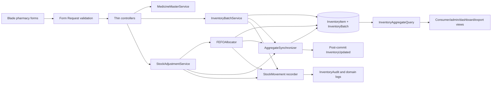

# Design Document: Pharmacy Medicine Batch Stock Management

## Overview

This design separates global medicine identity from pharmacy stock receipts while retaining `InventoryItem` as MedFind's unique pharmacy-plus-medicine aggregate. `InventoryBatch` becomes the authoritative quantity, expiry, supplier, lot, and receipt record. Existing aggregate columns remain during a compatibility period and are recalculated by one synchronization service rather than mutated directly.

The implementation language is PHP 8.2+ on Laravel 12. Controllers remain thin: request classes validate input, policies/scoped queries enforce pharmacy ownership, and transactional domain services own every stock mutation. Blade and Tailwind remain the presentation stack.

### Repository Research Findings

The design is based on the current repository rather than a greenfield model:

- `inventory_items` already has a unique `(pharmacy_id, medicine_id)` constraint, making `InventoryItem` the natural compatibility aggregate.
- `InventoryController::store` and `ReceivingController::store` currently call `updateOrCreate`, which overwrites batch metadata for later deliveries.
- Direct `stockQuantity` writes exist in `InventoryController`, `PharmacyDashboardController`, `ControlledSubstanceController`, `CycleCountController`, and `ReturnRecallController`.
- Consumer map/search/details, pharmacy and admin dashboards, CSV export, ABC/VED analysis, cycle counts, returns/recalls, controlled-substance logs, audits, events, factories, seeders, and migration transfer tests read aggregate columns directly.
- Uncommitted work already adds `brand_name`, `lot_number`, supplier free-text matching, scoped form autofill, old-input restoration, and deployment-related changes. Implementation must build on that working tree and must not revert unrelated files.
- The default automated database is SQLite `:memory:`; a guarded disposable PostgreSQL rehearsal also exists. New migrations and backfill logic must therefore avoid database-specific SQL.

Core architecture research came from the repository because the Laravel version, database targets, schema, route contracts, and test conventions are present locally. External research was limited to confirming the selected Eris release and PHPUnit 11 compatibility for the testing strategy. Implementation should use Laravel transactions, `lockForUpdate`, request validation, Eloquent relationships, and PHPUnit 11 already selected by the project.

### Design Decisions

1. **Batch rows are authoritative; aggregate rows are projections.** `inventory_batches.current_quantity` is the only persisted stock quantity operators may mutate. `inventory_items.stockQuantity`, `price`, and `status` remain compatibility projections.
2. **Duplicate delivery identity is rejected.** A normalized `identity_key` is unique within an aggregate. Rejecting duplicates avoids silently combining receipts that may have different dates, prices, or references.
3. **Expired stock remains physically visible but unavailable.** Expiry is date-based: a batch is valid through its expiry date and expired when `expiry_date < today` in the application timezone.
4. **FEFO is deterministic.** Eligible rows sort by non-null expiry ascending, null expiry last, then `received_date`, then `id`.
5. **Aggregate increases require a batch.** A decrease can be distributed across known batches. An increase cannot be traceable without batch metadata, so legacy bulk increases fail and guided adjustment flows create an adjustment batch.
6. **Migration retains legacy columns.** The first release does not drop batch-like columns from `inventory_items`; backfill copies them into child rows and synchronization keeps aggregate projections valid while integrations move.
7. **Time-driven expiry is handled at read and maintenance boundaries.** Consumer and alert queries compute available stock from batches, and a scheduled reconciliation command refreshes cached aggregate projections after a date boundary.

## Architecture



### Transaction Boundary

Every receipt, batch correction, FEFO decrease, cycle-count reconciliation, controlled-substance action, and return/recall executes in one `DB::transaction`:

1. Resolve the authenticated pharmacy and pharmacy-scoped aggregate.
2. Lock the aggregate with `lockForUpdate()`.
3. Lock affected batch rows in deterministic order.
4. Validate available quantities and duplicate identity under lock.
5. Apply batch changes.
6. Write one `StockMovement` per changed batch.
7. Write the existing aggregate `InventoryAudit` and required domain log.
8. Recalculate aggregate projections.
9. Commit.
10. Dispatch `InventoryUpdated` after commit with synchronized aggregate values.

No controller may assign `InventoryItem::stockQuantity` directly.

### Read Architecture and Expiry Boundary

`InventoryAggregateQuery` supplies SQL subqueries/scopes for available quantity, physical quantity, nearest valid expiry, and representative price. Public and alerting reads use these projections so an expired batch disappears from available stock even before the daily cache reconciliation runs. `inventory:reconcile-batches` runs after the application date changes and repairs cached aggregate columns in chunks. It is idempotent and can also be run manually after migration.

### Route Compatibility Matrix

| Existing/New route | Resulting responsibility |
|---|---|
| `GET pharmacy.inventory` | Aggregate medicine inventory list; route name and URL retained. |
| `GET pharmacy.inventory.create` | Add Medicine form; route name and URL retained. |
| `POST pharmacy.inventory.store` | Create/update Medicine Master and ensure aggregate; stock fields rejected with guidance. |
| `GET/PUT pharmacy.inventory.edit/update` | Edit Medicine Master and aggregate par level; route names retained; no direct quantity mutation. |
| `DELETE pharmacy.inventory.destroy` | Delete only an empty aggregate with no batch/audit/domain history; otherwise reject. |
| `GET pharmacy.receiving.create` | Official Add Stock/Receive Delivery form; route retained; optional scoped aggregate query preselects medicine. |
| `POST pharmacy.receiving.store` | Create one or more distinct batches transactionally; route retained. |
| `POST pharmacy.inventory.bulk-update` | Compatibility adjustment endpoint; decreases use FEFO, increases require guided batch metadata and are rejected by the legacy grid, representative-price edits target the representative batch. |
| `GET pharmacy.inventory.batches.index` | New all-batches view scoped to the current pharmacy. |
| `GET pharmacy.inventory.batches.show` | New FEFO batch list for one aggregate. |
| `GET/PUT pharmacy.inventory.batches.edit/update` | New safe metadata/correction flow for one batch. |
| `POST pharmacy.inventory.batches.adjust` | New explicit batch correction endpoint requiring a reason. |
| `GET pharmacy.inventory.export` | Existing aggregate CSV route retained. |
| `GET pharmacy.inventory.batches.export` | Optional route enabled by this feature for traceability-level CSV. |

Static routes such as `/inventory/batches` and `/inventory/export` must be declared before parameterized `/inventory/{inventoryItem}` routes.

## Components and Interfaces

### MedicineMasterService

```php
final class MedicineMasterService
{
    public function createForPharmacy(Pharmacy $pharmacy, array $attributes, int $parLevel): InventoryItem;
    public function updateForPharmacy(InventoryItem $aggregate, array $attributes, int $parLevel): InventoryItem;
}
```

- Keeps `medicine_name` as the Generic Name storage field.
- Owns `brand_name`, `dosage`, `category`, `manufacturer`, `requiresPrescription`, and `cold_chain_required` updates.
- Creates or retains the unique aggregate without creating stock.
- Does not accept batch or quantity attributes.

### BatchIdentity

```php
final class BatchIdentity
{
    public static function key(string $batchNumber, ?string $lotNumber): string;
    public static function legacy(int $inventoryItemId): string;
}
```

Normalization is implemented in PHP for identical PostgreSQL and SQLite behavior:

1. Unicode-aware trim.
2. Collapse internal whitespace to one ASCII space.
3. Unicode lowercase with `mb_strtolower`.
4. Encode unambiguously as `batch:<normalized>|lot:<normalized-or-empty>`.

Legacy rows without a batch number use display value `LEGACY-{inventory_item_id}` and key `legacy:{inventory_item_id}`.

### InventoryBatchService

```php
final class InventoryBatchService
{
    public function receive(Pharmacy $pharmacy, InventoryItem $aggregate, BatchReceiptData $data): InventoryBatch;
    public function updateMetadata(Pharmacy $pharmacy, InventoryBatch $batch, BatchMetadataData $data): InventoryBatch;
    public function correctQuantity(Pharmacy $pharmacy, InventoryBatch $batch, int $target, string $reason): StockOperationResult;
}
```

- Resolves or creates supplier names using the existing normalized free-text behavior.
- Enforces medicine cold-chain requirements.
- Rejects a duplicate identity before any mutation and relies on the unique index for race-safe enforcement.
- Records receipt/correction movements and invokes aggregate synchronization.
- Preserves `quantity_received` during metadata edits and corrections.

### FEFOAllocator

```php
final class FEFOAllocator
{
    public function decrease(
        Pharmacy $pharmacy,
        InventoryItem $aggregate,
        int $quantity,
        StockOperationContext $context
    ): StockOperationResult;

    public function decreaseSpecificBatch(
        Pharmacy $pharmacy,
        InventoryBatch $batch,
        int $quantity,
        StockOperationContext $context
    ): StockOperationResult;
}
```

The allocator performs validation before writes. Allocation can span batches, but expired rows are never eligible. A specific-batch return/recall validates that batch directly and still creates the same movement/audit records.

### StockAdjustmentService

```php
final class StockAdjustmentService
{
    public function setAggregateQuantity(
        Pharmacy $pharmacy,
        InventoryItem $aggregate,
        int $target,
        StockOperationContext $context,
        ?BatchReceiptData $increaseBatch = null
    ): StockOperationResult;
}
```

- `target < available`: decreases the delta with FEFO.
- `target === available`: creates no quantity records.
- `target > available`: requires `increaseBatch`; creates one adjustment batch with `quantity_received === current_quantity === delta`.
- Bulk requests validate every target before applying any item and use one outer transaction.
- Cycle counts and controlled adjustments supply generated references plus explicit operator reason/notes.

### AggregateSynchronizer

```php
final class AggregateSynchronizer
{
    public function synchronizeLocked(InventoryItem $aggregate, CarbonImmutable $asOf): InventoryItem;
    public function synchronizeChunk(int $chunkSize, CarbonImmutable $asOf): ReconciliationReport;
}
```

For an `asOf` date, the synchronizer calculates:

```text
available = SUM(current_quantity WHERE current_quantity > 0 AND (expiry_date IS NULL OR expiry_date >= asOf))
physical  = SUM(current_quantity WHERE current_quantity > 0)
```

The aggregate stores `available` in `stockQuantity`. `status` becomes `out_of_stock` at zero, `low_stock` when `0 < available <= par_level` and par level is positive, otherwise `available`. Representative price follows the deterministic rule in the glossary.

### InventoryAggregateQuery

Provides reusable scopes/subqueries rather than duplicated controller logic:

- `withAvailableStock(asOf)`
- `withPhysicalStock()`
- `withNearestValidExpiry(asOf)`
- `withRepresentativePrice(asOf)`
- `available()`, `belowPar()`, `outOfStock()`, `expiringWithin(days)`, `expiredPhysicalStock()`
- deterministic FEFO batch ordering

### StockOperationRecorder

Creates a UUID operation identifier and records:

- one immutable `StockMovement` per batch delta;
- one aggregate `InventoryAudit` when available aggregate quantity changes;
- reference type/id for cycle counts, controlled logs, and returns/recalls;
- actor, reason, and received reference;
- post-commit aggregate broadcast.

### Controllers and Requests

- `InventoryController`: aggregate list, Add Medicine, Edit Medicine/Par, constrained deletion, aggregate export.
- `ReceivingController`: multi-row receive form and batch receipt orchestration.
- `InventoryBatchController`: all-batch list, aggregate batch list, edit, correction, batch export.
- Existing controlled-substance, cycle-count, return/recall, dashboard, consumer, analysis, admin, and audit controllers call query/services rather than direct quantity assignments.
- Dedicated Laravel Form Requests validate medicine, receipt rows, batch edits, corrections, aggregate adjustments, and pharmacy ownership.

### UI Composition

- Add Medicine form contains only master fields plus par level and preserves old input.
- Receiving form retains repeatable rows but each row selects an existing scoped aggregate and includes batch, lot, quantity, price, supplier text, expiry, cold-chain, received date, and reference.
- Aggregate inventory is card/table responsive, with one medicine row and explicit Add Stock, View Batches, and Edit Medicine/Par actions.
- The main inventory table omits aggregate batch-count values; operators reach batch numbers, lots, and traceability through the retained View Batches actions and batch/receiving pages.
- Batch views visually separate Available, Depleted, and Expired stock and show physical expired quantities only to authorized pharmacy users.
- Dashboard exposes four distinct actions: Manage Inventory, Add New Medicine, Add Stock/Receive Delivery, and View Stock Batches.
- One `MedicineCategory` source owns the nine canonical option values and labels used by Add Medicine, Edit Medicine, and the inventory filter. The inventory filter appends only case-insensitively unique, nonblank categories from the authenticated pharmacy and compares trimmed categories with portable case-folded SQL; Edit Medicine appends its current custom value so legacy data remains selectable.
- One `back-button` Blade component provides the same accessible MedFind-purple left-arrow and `Back` link on every standalone pharmacy page. Each page supplies a deterministic named route to its dashboard or workflow parent; the Pharmacy dashboard is excluded as the navigation root, while form `Cancel` actions remain separate.

## Data Models

### Medicine (existing, extended)

| Field | Type | Notes |
|---|---|---|
| `medicine_name` | string | Existing compatibility field; UI label is Generic Name. |
| `brand_name` | nullable string | Preserve uncommitted migration and form work. |
| `dosage` | string | Existing field. |
| `category` | nullable string | Existing field. |
| `manufacturer` | string | Existing field. |
| `requiresPrescription` | boolean | Existing controlled/prescription behavior. |
| `cold_chain_required` | boolean default false | Product-level storage requirement. |

Relationships: `Medicine hasMany InventoryItem`.

### InventoryItem (existing aggregate)

| Field | Role after redesign |
|---|---|
| `pharmacy_id`, `medicine_id` | Unique aggregate identity; unique constraint retained. |
| `par_level` | Authoritative pharmacy-and-medicine threshold. |
| `stockQuantity` | Cached Available_Stock compatibility projection. |
| `price` | Cached Representative_Price compatibility projection. |
| `status` | Cached aggregate availability/low-stock projection. |
| `expiry_date`, `batch_number`, `lot_number`, `cold_chain`, `supplier_id` | Legacy compatibility columns retained during transition; no new workflow writes these as batch source-of-truth. |

Relationships: `belongsTo Pharmacy`, `belongsTo Medicine`, `hasMany InventoryBatch`, existing audits/logs/counts/returns remain attached.

### InventoryBatch (new authoritative child)

| Field | Type / constraint |
|---|---|
| `id` | bigint primary key |
| `inventory_item_id` | foreign key to aggregate, cascade delete only when aggregate deletion is permitted |
| `legacy_source_inventory_item_id` | nullable unique foreign/reference value used only for idempotent backfill |
| `batch_number` | string, required |
| `lot_number` | nullable string |
| `identity_key` | string, unique with `inventory_item_id` |
| `quantity_received` | non-negative integer |
| `current_quantity` | non-negative integer |
| `price` | decimal(10,2), non-negative |
| `supplier_id` | nullable foreign key, set null on supplier deletion |
| `supplier_name` | nullable string snapshot preserving entered text |
| `expiry_date` | nullable date |
| `cold_chain` | boolean |
| `received_date` | date, indexed |
| `received_reference` | nullable string |
| `created_by` | nullable foreign key to users, set null on user deletion |
| timestamps | preserve receipt creation/update chronology |

Indexes:

- unique `(inventory_item_id, identity_key)`;
- unique nullable `legacy_source_inventory_item_id`;
- `(inventory_item_id, expiry_date, received_date, id)` for FEFO;
- `(inventory_item_id, current_quantity)` for availability.

Application validation enforces `current_quantity <= quantity_received` for ordinary receipts. Explicit positive corrections create a new adjustment batch rather than increasing an existing batch above received quantity.

### StockMovement (new immutable ledger)

| Field | Type / purpose |
|---|---|
| `id` | bigint primary key |
| `operation_id` | UUID/string indexed; groups a business operation |
| `inventory_item_id` | aggregate foreign key |
| `inventory_batch_id` | batch foreign key |
| `type` | receipt, backfill, fefo_decrease, batch_correction, aggregate_adjustment, controlled, cycle_count, return, or recall |
| `before_quantity` | non-negative integer |
| `after_quantity` | non-negative integer |
| `quantity_delta` | signed integer; equals after minus before |
| `reason` | nullable text; required for manual correction |
| `reference_type`, `reference_id` | nullable domain linkage |
| `received_reference` | nullable string |
| `user_id` | nullable actor foreign key |
| `created_at` | immutable occurrence time |

No update or delete path is exposed for StockMovement.

### Existing Domain Records

- Add nullable `operation_id` to `inventory_audits` and `controlled_substance_logs` for direct correlation.
- `returns_recalls` and `cycle_count_items` continue referencing `inventory_item_id`; StockMovement `reference_type/reference_id` supplies batch allocations.
- Existing historical records remain valid without operation IDs.

### Migration and Backfill Algorithm

The schema/backfill migration uses Laravel schema APIs and PHP row iteration so SQLite and PostgreSQL follow the same normalization:

1. Add `medicines.cold_chain_required`.
2. Create `inventory_batches` and `stock_movements`; add nullable operation IDs.
3. Iterate `inventory_items` by primary key in chunks inside a transaction.
4. For each row, look up `inventory_batches.legacy_source_inventory_item_id = inventory_items.id`.
5. If absent, create one backfill batch:
   - display batch number: trimmed legacy value or `LEGACY-{id}`;
   - identity key: normalized legacy batch/lot when batch exists, otherwise `legacy:{id}`;
   - both quantities: exact non-negative legacy `stockQuantity`;
   - copy price, lot, expiry, cold-chain, supplier, and timestamps;
   - supplier name snapshot from the linked supplier;
   - received date from `created_at`, falling back to the migration date;
   - reference `legacy-inventory:{id}`.
6. Create one idempotent backfill StockMovement keyed by deterministic operation identifier `legacy-backfill:{id}` if absent.
7. Verify every legacy row has exactly one backfill batch and exact copied values.
8. Recalculate aggregate projections without dropping legacy columns.
9. Throw on verification failure so the database transaction rolls back.

Migration tests cover zero stock, null batch/lot/expiry/supplier, expired stock, Unicode, sparse IDs, repeated invocation, and existing partially backfilled rows. The canonical transfer policy and PostgreSQL rehearsal fixtures are extended in dependency order: medicines/suppliers/inventory_items, then inventory_batches, then stock_movements and aggregate/domain logs.

## Correctness Properties

*A property is a characteristic or behavior that should hold true across all valid executions of a system-essentially, a formal statement about what the system should do. Properties serve as the bridge between human-readable specifications and machine-verifiable correctness guarantees.*

The consolidation review removed overlapping checks before this section was written. In particular, stock-sum, expiry-exclusion, and status criteria are one aggregate projection property; FEFO eligibility, order, spanning, and exact decrement are one allocation property; and movement cardinality, delta conservation, operation correlation, and aggregate audit behavior are one ledger property. This avoids weaker properties being implied by stronger ones.

### Property 1: Medicine edits preserve batch stock

For all valid Medicine_Master and par-level edits and for all existing Inventory_Batch sets, applying the edit changes only permitted medicine/aggregate fields and preserves every batch identity, quantity, and movement record.

**Validates: Requirements 1.1, 2.5**

### Property 2: Medicine master round trip

For all valid medicine master field values, storing and reloading the Medicine_Master preserves Generic Name through `medicine_name` and preserves Brand Name, Dosage, Category, Manufacturer, prescription classification, and cold-chain requirement.

**Validates: Requirements 2.1, 2.2**

### Property 3: Aggregate creation is idempotent

For all pharmacy and Medicine_Master pairs, invoking create-or-retain aggregate behavior one or more times results in exactly one Pharmacy_Inventory_Aggregate for that pair.

**Validates: Requirements 2.4**

### Property 4: Receipt preserves submitted batch data

For all valid receipt payloads, receiving stock creates one Inventory_Batch whose normalized optional metadata round-trips and whose quantity received and current quantity both equal the submitted positive quantity.

**Validates: Requirements 3.5, 3.10**

### Property 5: Supplier normalization is confluent

For all non-empty Supplier_Name values equivalent after case-folding and whitespace normalization, receiving those values in any order links batches to one supplier record; for all previously unmatched normalized names, the first receipt creates exactly one supplier record.

**Validates: Requirements 3.7, 3.8**

### Property 6: Product cold-chain requirement implies batch cold-chain

For all Medicine_Master and Inventory_Batch combinations accepted by the Inventory_Batch_Service, a true product cold-chain requirement implies a true batch cold-chain state.

**Validates: Requirements 3.9**

### Property 7: Batch identity is unique and non-destructive

For all normalized batch-and-lot identity pairs within one Pharmacy_Inventory_Aggregate, distinct keys coexist without changing earlier batches, while equivalent keys are rejected and leave the complete aggregate, batch, movement, and audit state unchanged.

**Validates: Requirements 3.11, 3.12, 5.9**

### Property 8: Aggregate quantity and status projection

For all Inventory_Batch sets and as-of dates, synchronized `stockQuantity` equals the sum of positive non-expired current quantities, Physical_Stock equals the sum of all positive current quantities, expired rows remain present, and aggregate status equals the defined function of Available_Stock and par level.

**Validates: Requirements 4.2, 4.6, 4.7, 4.8**

### Property 9: Representative price is deterministic

For all Inventory_Batch sets, Representative_Price is the price of the latest received non-expired positive batch using identifier as final tie-breaker; when no batch is available, Representative_Price is the price of the latest received batch.

**Validates: Requirements 4.3, 4.4**

### Property 10: Nearest valid expiry follows FEFO

For all Inventory_Batch sets and as-of dates containing at least one eligible batch with an expiry date, nearest valid expiry is the expiry of the first positive non-expired batch in FEFO_Order.

**Validates: Requirements 4.9, 5.4**

### Property 11: Batch metadata edits preserve immutable history

For all valid batch metadata edits, quantity received and all pre-existing Stock_Movement records are identical before and after the edit.

**Validates: Requirements 5.6**

### Property 12: FEFO allocation is exact and ordered

For all Inventory_Batch sets with sufficient Available_Stock and all positive requested decreases, the FEFO_Allocator excludes expired batches, consumes eligible batches in FEFO_Order, never produces a negative current quantity, may span batches, and decreases the total eligible quantity by exactly the request.

**Validates: Requirements 6.2, 6.3, 6.4, 6.5, 7.1**

### Property 13: Insufficient decreases are atomic

For all Inventory_Batch sets and requested decreases greater than Available_Stock, the FEFO_Allocator rejects the operation and preserves every aggregate, batch, movement, audit, and domain-log value.

**Validates: Requirements 6.6**

### Property 14: Stock ledger conserves every successful operation

For all successful stock operations, each changed batch has exactly one Stock_Movement with `quantity_delta = after_quantity - before_quantity`, all operation records share one operation identifier, the sum of movement deltas equals the aggregate available-stock delta after accounting for expiry eligibility, and exactly one Inventory_Audit is created when Available_Stock changes.

**Validates: Requirements 6.7, 12.2, 12.3, 12.4**

### Property 15: Bulk adjustment validation is atomic

For all multi-item bulk requests containing at least one invalid target or unauthorized aggregate, no requested quantity or price change is applied to any aggregate or batch.

**Validates: Requirements 7.5**

### Property 16: Aggregate increases create only traceable stock

For all aggregate targets greater than Available_Stock and all valid increase-batch metadata, the Stock_Adjustment service creates one adjustment Inventory_Batch whose two quantities equal the target delta; without complete metadata the operation leaves all state unchanged.

**Validates: Requirements 7.2, 7.7, 7.9**

### Property 17: Legacy backfill is preserving and idempotent

For all valid Legacy_Inventory_Row sets, one backfill run preserves aggregate primary keys and relationships, creates exactly one source-linked Inventory_Batch per legacy row with equivalent quantities and metadata, and every subsequent run produces the same canonical database state without duplicate batches or movements.

**Validates: Requirements 8.1, 8.2, 8.3, 8.4, 8.5, 8.6, 8.9, 8.10**

### Property 18: Consumer stock equals available batch stock

For all approved-pharmacy batch sets, every consumer map, search, and pharmacy-detail stock value equals Available_Stock and is invariant under changes that affect only expired-batch quantities.

**Validates: Requirements 9.1, 9.3**

### Property 19: Analysis value uses aggregate availability

For all aggregate projections, inventory analysis receives a stock value equal to Available_Stock multiplied by Representative_Price.

**Validates: Requirements 9.7**

### Property 20: Pharmacy isolation

For all pairs of distinct pharmacies and all aggregates and batches owned by either pharmacy, an authenticated Pharmacy_Operator can list and mutate only records belonging to the Pharmacy_Operator pharmacy.

**Validates: Requirements 10.1, 10.2**

## Approved Ad-Hoc Design: Basic Record Sale

The Basic_Record_Sale is a thin HTTP workflow over a dedicated transactional `BasicSaleService`; it introduces no POS or sale-header table. Existing `StockMovement` rows preserve each batch allocation, actor, timestamp, reason, `Sale_Reference`, and shared operation ID. One `InventoryAudit` per changed aggregate shares that operation ID and stores the `Sale_Reference` in its notes, so the existing immutable ledger is sufficient.

- Add `GET pharmacy.sales.create` and `POST pharmacy.sales.store` inside the existing pharmacy middleware group, a `SaleController`, and `RecordSaleRequest`.
- Place Record Sale first in the eight-card dashboard action grid beside Manage Inventory; retain one phone column and two medium columns, with four columns and two complete rows at XL widths.
- Render every dashboard action link with the same full-width, centered, wrapping-safe dimensions and transition contract while preserving its color and content; map each statistic to explicit matching `*-600` value and `*-200` icon classes so the production build discovers every color.
- The responsive Blade form renders repeatable aggregate-and-positive-quantity rows only, plus read-only server-reference/timestamp/staff context and optional notes; it never exposes a batch selector. Its catalog contains only saleable aggregates owned by the authenticated pharmacy and clearly handles an empty catalog.
- Each Medicine field progressively enhances its named pharmacy-scoped aggregate `<select>` into a dependency-free combobox. The visible search input has no submitted name, edits clear the selected identifier until an option is explicitly chosen, result labels include generic name, brand, dosage, and Available_Stock, and per-row IDs plus initialization hooks cover initial, added, and validation-restored rows. The combobox supports pointer selection, click-away dismissal, no-results feedback, and standard Arrow/Enter/Escape behavior with listbox ARIA relationships.
- `RecordSaleRequest` validates indexed fields and rejects duplicate aggregate rows. The service independently rejects duplicate/invalid lines, resolves every aggregate through one pharmacy-scoped locked query, and returns a not-found result for any missing or foreign identifier.
- `BasicSaleService` generates one Sale_Reference and one `StockOperationContext`, opens one outer transaction, and invokes `FEFOAllocator::decrease()` for each line. Nested allocator work therefore shares operation/reference/actor metadata, excludes expired batches, follows deterministic FEFO, synchronizes aggregates, and fully rolls back when any later line fails.
- Insufficient-stock errors identify the failing row and report requested and currently available quantities while returning all submitted rows as old input.

### Property 21: Basic sales are atomic FEFO operations

For all valid multi-item sale quantities within Available_Stock, recording a Basic_Record_Sale reduces each aggregate by exactly its requested quantity through FEFO and every movement/audit shares one operation ID, Sale_Reference, and actor; if any line exceeds Available_Stock, every aggregate, batch, movement, and audit remains unchanged.

**Validates: Requirements 14.3-14.8**

## Error Handling

### Validation Errors

- Form Requests return field-specific errors and flash complete old input, including indexed receiving rows.
- Medicine endpoints reject stock-specific fields and link the user to Add Stock/Receive Delivery.
- Receiving rejects missing scoped aggregate, blank batch number, non-positive quantity, invalid decimal price, impossible dates, oversized text, and cold-chain violations.
- Duplicate identity is checked before mutation; a database unique-constraint race is caught and converted to the same validation message.
- Manual corrections require a reason. Aggregate increases additionally require complete adjustment-batch metadata.

### Domain Errors

Domain services throw typed exceptions that controllers translate without leaking record ownership:

- `InsufficientAvailableStock`: includes requested and current available quantities.
- `DuplicateBatchIdentity`: identifies batch and lot values, not another pharmacy.
- `ColdChainRequired`: identifies the product requirement.
- `UntraceableStockIncrease`: directs the operator to an adjustment/receiving flow.
- `AggregateHasHistory`: blocks destructive aggregate deletion.
- `ForeignInventoryRecord`: rendered as HTTP 404.

### Transaction and Concurrency Errors

- Lock and unique-constraint conflicts roll back the entire operation.
- Services retry only database-defined transient deadlock/serialization failures through Laravel's transaction attempt parameter; validation and domain failures are never retried.
- Movement, audit, domain-log, synchronization, and receipt writes share one transaction.
- Broadcast dispatch occurs after commit, so consumers never receive rolled-back values.

### Migration Errors

- Schema creation precedes backfill; legacy columns are not dropped.
- Every copied row is verified before commit.
- Null and malformed legacy values are normalized only where the old schema permits them; negative legacy quantities or unverifiable relationships fail closed.
- The backfill uses deterministic source markers and operation identifiers so reruns are safe after interrupted deployment attempts.
- SQLite and PostgreSQL tests must show equivalent normalized data before production rollout.

## Testing Strategy

### Test Stack

- **PHP unit/feature/integration tests:** existing PHPUnit 11 and Laravel testing utilities.
- **Property-based tests:** pin `giorgiosironi/eris` at exact version `1.1.0`, which declares PHPUnit 11 support, rather than building a generator framework in the repository. See the [Eris package metadata](https://repo.packagist.org/p2/giorgiosironi/eris.json) and [Eris repository](https://github.com/giorgiosironi/eris).
- **Browser responsiveness:** existing Playwright dependency, using one-shot test execution rather than watch mode.
- **Databases:** SQLite `:memory:` by default and the existing guarded disposable PostgreSQL rehearsal when explicitly enabled.

Content was rephrased for compliance with licensing restrictions.

### Property Tests

Each of the 20 design properties gets exactly one Eris property test with at least 100 iterations. Each test includes a comment in this exact form:

```php
// Feature: pharmacy-medicine-batch-stock-management, Property 12: FEFO allocation is exact and ordered
```

Generators cover:

- Unicode and whitespace variants for medicine, supplier, batch, and lot names;
- batch vectors with zero/positive quantities;
- expired, today-expiring, future, and null expiry dates;
- duplicate and distinct normalized identities;
- sufficient and insufficient requested quantities;
- sparse legacy primary keys and nullable metadata;
- two or more pharmacy ownership graphs.

Tests use a frozen application clock. Pure reference functions calculate normalized identity, available/physical sums, representative price, FEFO order, and expected allocations independently from production services.

### Unit and Example Tests

Focused tests cover:

- Form Request boundaries and nested error messages;
- route compatibility and route ordering;
- empty aggregate and no-expiry fallbacks;
- old-input restoration for Add Medicine, multi-row receiving, and batch correction;
- aggregate deletion safeguards;
- insufficient-stock message values;
- batch-specific return/recall behavior;
- daily reconciliation command idempotence;
- static guard against direct controller `stockQuantity` assignment.

### Feature and Integration Tests

Feature tests execute:

- Add Medicine without stock creation;
- multi-row receiving and supplier free-text matching;
- aggregate and batch pages, actions, filters, and pagination;
- controlled dispensing/wastage/transfer and adjustment;
- lower and higher cycle-count reconciliation;
- aggregate and batch-specific returns/recalls;
- bulk-update compatibility and all-or-nothing behavior;
- dashboard, consumer map/search/details, admin inventory, ABC/VED analysis, CSV exports, audits, logs, and post-commit broadcasts;
- cross-pharmacy read/mutation denial;
- factories and every inventory seeder.

### Migration Tests

1. Extend SQLite migration preservation fixtures with brand, lot, InventoryBatch, and StockMovement data.
2. Run fresh migration, legacy-to-current migration, partial-backfill rerun, and failure rollback cases.
3. Verify row counts, primary keys, foreign keys, canonical hashes, exact decimal/date/Unicode values, and compatibility columns.
4. Extend `OneTimeMigrationUtility` table policy and dependency order.
5. Extend the opt-in PostgreSQL rehearsal and dump/restore verification without weakening its disposable-cluster guards.
6. Keep `phpunit.xml` on SQLite `:memory:` and prevent accidental production/test database access.

### UI Tests

Playwright checks 320px, tablet, and desktop layouts for horizontal page overflow, visible required actions, repeatable receiving rows, validation restoration, and batch-list readability. UI tests do not substitute for service and feature tests.

### Validation Sequence

Implementation validation runs in this order:

1. Focused unit/property tests for identity, projections, FEFO, adjustment, and backfill.
2. Focused Laravel feature tests for inventory and dependent workflows.
3. Full `php artisan test` suite on SQLite `:memory:`.
4. Guarded PostgreSQL rehearsal only in its proven disposable environment.
5. `vendor/bin/pint --test`.
6. `npm run build`.

Before and after implementation, capture `git status --short` and review the diff to confirm unrelated uncommitted Railway, PostgreSQL, Reverb, JavaScript, layout, and form work remains present.
